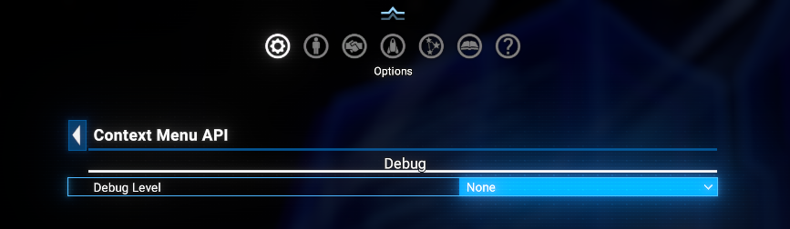

# Context Menu API

An API mod for X4: Foundations that *extends* the modding surface beyond what *SirNukes Mod Support APIs* covers, targeting menus and context frame modes not exposed by that API. Currently it supports the `Information` panel context frames on `Map` screen, and the `Personnel Management`, `Inventory`, `Spacesuit Upgrades`, and `Transaction Log` context frames on `Player Info` screen.

## Overview

The mod intercepts `createContextFrame` on the supported menus and fires a signal before the frame is built. Consumers respond synchronously (within the same MD tick / Lua call) by appending entries via the builder API.

Two integration paths exist, both with equivalent capabilities:

- **MD API** - for Mission Director scripts. Uses `Get_Actions` / `Add_Action` cue signals.
- **Lua API** - for Lua UI scripts. Register a callback via `cmAPI.registerLuaCallback(fn)`; the function returns a list of entry tables, which the API renders using the same pipeline as MD entries.

## Requirements

- **X4: Foundations**: Version **8.00HF4** or higher and **UI Extensions and HUD**: Version **v8.0.4.x** or higher by [kuertee](https://next.nexusmods.com/profile/kuertee?gameId=2659):
  - Available on Nexus Mods: [UI Extensions and HUD](https://www.nexusmods.com/x4foundations/mods/552)
- **X4: Foundations**: Version **9.00 beta 3** or higher and **UI Extensions and HUD**: Version **v9.0.0.0.3** or higher by [kuertee](https://next.nexusmods.com/profile/kuertee?gameId=2659).
- **Mod Support APIs**: Version 1.95 or higher by [SirNukes](https://next.nexusmods.com/profile/sirnukes?gameId=2659):
  - Available on Steam: [SirNukes Mod Support APIs](https://steamcommunity.com/sharedfiles/filedetails/?id=2042901274)
  - Available on Nexus Mods: [Mod Support APIs](https://www.nexusmods.com/x4foundations/mods/503)
- **Options Helper**: Version 1.0 or higher by [Chem O`Dun](https://next.nexusmods.com/profile/ChemODun/mods?gameId=2659):
  - Available on Steam: [Options Helper](https://steamcommunity.com/sharedfiles/filedetails/?id=3715253556)
  - Available on Nexus Mods: [Options Helper](https://www.nexusmods.com/x4foundations/mods/2089)

## Installation

- **Steam Workshop**: [Context Menu API](https://steamcommunity.com/sharedfiles/filedetails/?id=0)
- **Nexus Mods**: [Context Menu API](https://www.nexusmods.com/x4foundations/mods/2110)

## MD API

### Flow

```
1. Your cue listens to  md.Context_Menu_API.Get_Actions
2. Check event.param.$mode (and other fields) to decide what to add
3. Call md.Context_Menu_API.Add_Action one or more times (synchronously)
4. The API builds the frame; user clicks trigger your $callback cue
```

### `Get_Actions` - event fields

- `$menuName` *(string)* - source menu (`"MapMenu"`)
- `$mode` *(string)* - context frame mode, e.g. `"info_context"`, `"trade"` (see Vanilla context menu modes below); changes at every sub-menu level
- `$rootMode` *(string)* - the original vanilla mode that opened the menu; stays constant across all sub-menu levels (same as `$mode` at the root level)
- Additional mode-specific string fields (e.g. `$component`, `$entity`, `$person`, `$inv_ware`, `$weaponmacro`, ...) - see per-mode docs below

### `Add_Action` - entry fields

- `$type` - entry type: `"menuItem"` (default), `"subMenu"`, `"separator"`, `"header"`
- `$id` *(string)* - unique ID; required for `menuItem` / `subMenu` / `header`; for `menuItem` auto-derived from `$text` if omitted and `$callback` is set
- `$text` *(string)* - display label
- `$icon` *(string, optional)* - icon name (X4 icon set); prepended to `$text` as `\027[icon] text`
- `$text2` *(string, optional)* - right-side secondary text; for `subMenu` the API fills in `>` if omitted
- `$textColor` *(string, optional)* - Color key for the main text (e.g. `'text_positive'`); default: `'text_normal'`
- `$text2Color` *(string, optional)* - Color key for `$text2`; default: `'text_normal'`
- `$mouseOver` *(string, optional)* - tooltip text shown on hover
- `$mouseOverIcon` *(string, optional)* - icon prepended to the tooltip text
- `$callback` *(cue reference)* - cue to call when this `menuItem` is clicked
- `$echo` *(any, optional)* - arbitrary value passed back in `event.param.$echo` of the callback
- `$active` *(bool)* - whether the entry is clickable; default: `true` (auto-set to `false` when no `$callback`)
- `$keepOpen` *(bool, optional)* - if `true`, the context menu stays open after the click; default: menu closes

### Callback `event.param` fields

The callback cue receives all original `Get_Actions` fields, i.e.:

- `$menuName` *(string)* - source menu (`"MapMenu"`)
- `$mode` *(string)* - same as in `Get_Actions`
- `$rootMode` *(string)* - same as in `Get_Actions`
- Additional mode-specific string fields - same as in `Get_Actions`

**plus**:

- `$id` - the action ID that was clicked
- `$echo` - the value of `$echo` passed to `Add_Action` (if any) or `null`.

### Minimal example - append to an existing mode

```xml
<cue name="On_CMA_Get_Actions" instantiate="true">
    <conditions>
        <event_cue_signalled cue="md.Context_Menu_API.Get_Actions" />
    </conditions>
    <actions>
        <do_if value="event.param.$mode == 'info_context' and event.param.$entity?">
            <signal_cue_instantly cue="md.Context_Menu_API.Add_Action"
                param="table[
                    $type     = 'menuItem',
                    $text     = 'My Action',
                    $icon     = 'order_follow',
                    $callback = My_Callback,
                    $echo     = event.param.$entity,
                ]" />
        </do_if>
    </actions>
</cue>

<cue name="My_Callback" instantiate="true">
    <conditions>
        <event_cue_signalled />
    </conditions>
    <actions>
        <!-- event.param.$echo is the entity from above -->
        <debug_text text="'clicked on entity: %s'.[event.param.$echo]" />
    </actions>
</cue>
```

### Multi-level sub-menus (MD)

A `subMenu` entry navigates to a new blank frame identified by `$id`. The API manages a navigation stack and injects a `< Back` button automatically. Supply a `header` as the first entry of a custom mode to label the frame.

```xml
<cue name="On_CMA_Get_Actions" instantiate="true">
    <conditions>
        <event_cue_signalled cue="md.Context_Menu_API.Get_Actions" />
    </conditions>
    <actions>

        <!-- Append sub-menu trigger to the vanilla frame -->
        <do_if value="event.param.$mode == 'info_context'">
            <signal_cue_instantly cue="md.Context_Menu_API.Add_Action"
                param="table[$type = 'separator']" />
            <signal_cue_instantly cue="md.Context_Menu_API.Add_Action"
                param="table[$type = 'subMenu', $text = 'My Tool', $id = 'mytool_main']" />
        </do_if>

        <!-- Define the custom mode contents (header + items) -->
        <do_elseif value="event.param.$mode == 'mytool_main'">
            <signal_cue_instantly cue="md.Context_Menu_API.Add_Action"
                param="table[$type = 'header', $text = 'My Tool']" />
            <signal_cue_instantly cue="md.Context_Menu_API.Add_Action"
                param="table[$type = 'menuItem', $text = 'Do Something', $id = 'mytool_do', $callback = My_Action]" />
            <signal_cue_instantly cue="md.Context_Menu_API.Add_Action"
                param="table[$type = 'subMenu', $text = 'More Options', $id = 'mytool_sub']" />
        </do_elseif>

        <do_elseif value="event.param.$mode == 'mytool_sub'">
            <signal_cue_instantly cue="md.Context_Menu_API.Add_Action"
                param="table[$type = 'header', $text = 'More Options']" />
            <signal_cue_instantly cue="md.Context_Menu_API.Add_Action"
                param="table[$type = 'menuItem', $text = 'Option A', $id = 'mytool_a', $callback = My_Action]" />
        </do_elseif>

    </actions>
</cue>
```

Note: Do NOT add a `back` entry manually - the API inserts it automatically for every custom mode, right after the leading `header` (if present).

## Lua API

### Flow (Lua)

```
1. At init time, call  cmAPI.registerLuaCallback(fn)
2. fn(menuName, mode, rootMode, data) is called synchronously on every whitelisted context open
3. Return a list of entry tables (same fields as MD Add_Action, with onClick instead of $callback)
4. The API renders the entries; user clicks invoke your onClick function directly
```

### `registerLuaCallback` - signature

```lua
local cmAPI = require("extensions.context_menu_api.ui.context_menu_api")
cmAPI.registerLuaCallback(function(menuName, mode, rootMode, data)
    -- return a list of entry tables, or {} to add nothing
end)
```

- `menuName` *(string)* - source menu name, e.g. `"MapMenu"`
- `mode` *(string)* - current context frame mode (changes at sub-menu levels)
- `rootMode` *(string or nil)* - original vanilla mode that opened the menu; constant across sub-menu levels
- `data` *(table or nil)* - raw context data table; fields mirror the MD param fields but as Lua values (`data.component` and `data.entity` are uint64 cdata; `data.person` is the raw NPCSeed cdata, not yet resolved to an entity)

The callback is called for **every** whitelisted open across all supported menus. Filter by `menuName` and `mode` inside your callback as needed.

### Entry table fields

Entry tables mirror the MD `Add_Action` fields, with two differences:

- Field names are plain Lua strings (no `$` prefix)
- Use `onClick` instead of `callback` + `echo`

- `type` *(string)* - `"menuItem"` (default), `"subMenu"`, `"separator"`, `"header"`
- `id` *(string)* - **required** for `menuItem` and `subMenu`; entries without `id` are silently skipped
- `text` *(string)* - display label
- `icon` *(string, optional)* - X4 icon name; prepended to `text`
- `text2` *(string, optional)* - right-side secondary text; `subMenu` defaults to `>`
- `textColor` *(string, optional)* - color key, e.g. `"text_positive"`
- `text2Color` *(string, optional)* - color key for `text2`
- `mouseOver` *(string, optional)* - tooltip text
- `mouseOverIcon` *(string, optional)* - icon prepended to the tooltip
- `active` *(bool)* - whether the entry is clickable; default `true`
- `keepOpen` *(bool, optional)* - if `true`, menu stays open after click; default `false`
- `onClick` *(function)* - called as `onClick(data, mode)` when the entry is clicked; `data` and `mode` are the same values passed to the callback

> **Note:** `onClick` closures already capture any context the caller needs. There is no `echo` field - closures are the Lua-native equivalent.

### Minimal example (Lua) - append to an existing mode

```lua
local cmAPI = require("extensions.context_menu_api.ui.context_menu_api")

cmAPI.registerLuaCallback(function(menuName, mode, rootMode, data)
    if mode ~= "info_context" then return {} end
    return {
        {
            type    = "menuItem",
            id      = "mymod_action",
            text    = "My Lua Action",
            icon    = "order_follow",
            onClick = function(data, mode)
                DebugError("clicked entity: " .. tostring(data.component))
            end,
        },
    }
end)
```

### Multi-level sub-menus (Lua)

Sub-menu navigation works identically to MD. Return a `subMenu` entry with an `id`; define the contents of that custom mode in the same callback by checking `mode`.

```lua
cmAPI.registerLuaCallback(function(menuName, mode, rootMode, data)
    if mode == "info_context" then
        return {
            { type = "subMenu", id = "mytool_main", text = "My Tool" },
        }
    elseif mode == "mytool_main" then
        return {
            { type = "header", text = "My Tool" },
            { type = "subMenu",  id = "mytool_sub",  text = "More Options" },
            {
                type    = "menuItem",
                id      = "mytool_do",
                text    = "Do Something",
                onClick = function(data, mode) DebugError("did something") end,
            },
        }
    elseif mode == "mytool_sub" then
        return {
            { type = "header", text = "More Options" },
            {
                type    = "menuItem",
                id      = "mytool_a",
                text    = "Option A",
                onClick = function(data, mode) DebugError("option A") end,
            },
        }
    end
    return {}
end)
```

The `< Back` button is inserted automatically. Do NOT return a `back` entry.

## Supported game Menus/Screens and Modes

These are the two Menus(screens) are supported by the API: `MapMenu` (the main map screen) and `PlayerInfoMenu`. Each menu has a set of supported modes (context frame types).

### Supported modes per Menu with attached data fields

These modes use a single-column frame and are whitelisted in the API. The `Get_Actions` event fires only for these modes. Entry injection and custom sub-menus work fully.

#### MapMenu

When **mode** is equal to `"info_context"` - the most useful entry point. Opens when the player right-clicks a crew member, pilot, manager, or ship trader in the info panel.

**On pilots/managers/traders:**

- `$type` *(string)* - `"entity"`
- `$component` *(component or null)* - controllable (ship or station) as MD component reference
- `$entity` *(component or null)* - pilot or manager NPC as MD component reference
- `$instance` *(string or null)* - `"left"` or `"right"` for dual-panel frames; null otherwise
- `$xoffset` *(number)* - mouse X offset from the default frame position;
- `$yoffset` *(number)* - mouse Y offset from the default frame position

**On crew members and other personnel:**

- `$type` *(string)* - `"person"`
- `$component` *(component or null)* - controllable (ship or station) as MD component reference
- `$person` *(NPCSeed or null)* - crew member as raw NPCSeed/npctemplate reference
- `$instance` *(string or null)* - `"left"` or `"right"` for dual-panel frames; null otherwise
- `$xoffset` *(number)* - mouse X offset from the default frame position;
- `$yoffset` *(number)* - mouse Y offset from the default frame position

**On loadout items (Equipment)**:

- or `$weaponmacro` *(string or null)* - weapon macro string when a weapon row was clicked
- or `$equipmentmacro` *(string or null)* - equipment/deploy macro string when an equipment row was clicked
- or `$software` *(string or null)* - software macro string when a software row was clicked

**On pilot/captain inventory items**:

- `$inv_ware` *(string or null)* - ware macro string when an inventory item row was clicked

#### PlayerInfoMenu

When **mode** is equal to `inventory` - context actions for a selected ware in the player's inventory or spacesuit equipment.

- `$ware` *(string)* - ware macro string of the selected item, e.g. `"modpart_weaponchamber_t2"`
- `$name` *(string)* - localized display name of the ware, e.g. `"Advanced Weapon Chamber"`
- `$amount` *(number)* - quantity of the ware currently held
- `$price` *(number)* - unit price in credits (may be 0 or 1 for non-tradeable items)
- `$selectedWares` *(array)* - list of ware macro strings currently selected (usually one element matching `$ware`)

When **mode** is equal to **`personnel`** - context actions for a selected crew member, pilot, manager, or trader in the personnel list.

**On pilots/managers/traders:**

- `$type` *(string)* - `"entity"`
- `$subMode` *(string)* - personnel sub-mode, e.g. `"personnel_employee"`
- `$component` *(component)* - controllable (ship or station) as MD component reference
- `$container` *(number)* - same UniverseID as `$component` (raw integer before MD resolution)
- `$containername` *(string)* - display name of the ship or station
- `$entity` *(component)* - the NPC as MD component reference
- `$name` *(string)* - NPC display name
- `$roleid` *(string)* - role identifier, e.g. `"manager"`, `"aipilot"`, `"shiptrader"`
- `$rolename` *(string)* - localised role display name, e.g. `"Manager"`, `"Captain"`, `"Ship trader"`
- `$combinedskill` *(number)* - combined skill value (0–100)
- `$skill` *(number)* - filtered/sorted skill value (same as `$combinedskill` when no role filter is active)

**On crew members and other personnel:**

- `$type` *(string)* - `"person"`
- `$subMode` *(string)* - personnel sub-mode, e.g. `"personnel_employee"`
- `$component` *(component)* - controllable (ship or station) as MD component reference
- `$container` *(number)* - same UniverseID as `$component` (raw integer before MD resolution)
- `$containername` *(string)* - display name of the ship or station
- `$person` *(npctemplateentry)* - crew NPC resolved from NPCSeed; access `.name`, `.role.name`, etc.
- `$name` *(string)* - NPC display name
- `$roleid` *(string)* - role identifier, e.g. `"service"`, `"marine"`, `"unassigned"`
- `$rolename` *(string)* - localised role display name, e.g. `"Service crew"`
- `$combinedskill` *(number)* - combined skill value (0–100)
- `$skill` *(number)* - filtered/sorted skill value (same as `$combinedskill` when no role filter is active)

When **mode** is equal to **`transactionlog`** - context actions for a selected transaction log entry.

- `$entryid` *(number)* - unique ID of the log entry
- `$eventtype` *(string)* - internal event type, e.g. `"orderqueue_add"`, `"orderqueue_remove"`
- `$eventtypename` *(string)* - localised event type name, e.g. `"Trade Order"`, `"Profit from Trade Orders"`
- `$active` *(number)* - `1` if the entry is currently active
- `$complete` *(number)* - `1` if the transaction is complete, `0` if still pending
- `$money` *(number)* - money change for this entry in credits (negative = paid, positive = received)
- `$amount` *(number)* - ware quantity involved; `0` for non-ware events
- `$price` *(number)* - unit price in Cr; `0` for non-ware events
- `$ware` *(string)* - ware id string, e.g. `"siliconcarbide"`; empty string for non-ware events
- `$description` *(string)* - human-readable summary of the transaction; empty for completed entries
- `$partner` *(component or null)* - trading partner as MD component reference
- `$partnername` *(string)* - display name of the trading partner
- `$contextObject` *(component or null)* - context object as MD component reference (often same as `$partner`)
- `$contextObjectName` *(string)* - display name of the context object
- `$buyer` *(component or null)* - buyer component; may be null when not applicable
- `$seller` *(component or null)* - seller component; may be null when not applicable
- `$tradeentry` *(number)* - trade entry reference ID; `0` if none
- `$tradeentrytype` *(string)* - trade entry type string, e.g. `"trade"`; empty if none
- `$tradeentrytypename` *(string)* - localised trade entry type name, e.g. `"Trade Payment"`, `"Unknown"`
- `$destroyedpartner` *(number)* - `1` if the partner was destroyed during the trade
- `$time` *(number)* - game time (seconds) when the entry was recorded

### Excluded modes

These modes currently does not supported by the API. Mostly because they are complex windows with a lot of UI elements, i.e. they are a far beyond the scope of a simple context menu.
It's support can be added in the future if there's demand, but for now they are listed here for reference.
No `Get_Actions` event is fired for these modes; the API passes through transparently and does not interfere with them.

#### MapMenu excluded modes

These modes are not in the whitelist. No `Get_Actions` event is fired; the API passes through transparently. They are documented here for reference.

- **`neworder`** - order selection list when assigning a new order to a ship (1-column).

  possible additional fields: `$instance` (string, which panel side)

- **`set_orderparam_formationshape`** - formation shape picker for an order parameter (1-column).

  possible additional fields: `$index` (number, parameter index), `$instance` (string)

- **`searchfield`** - search input overlay (1-column). No meaningful data fields.

- **`select`** - generic single-component selection picker (1-column).

  possible additional fields: `$component` (string, UniverseID of the pre-selected component)

- **`set_orderparam_sector`** - sector picker for an order parameter (3-column table).

  possible additional fields: `$index` (number, parameter index in the order), `$instance` (string)

- **`set_orderparam_ware`** - ware picker for an order parameter (3-column table).

  possible additional fields: `$index` (number, parameter index), `$instance` (string)

- **`orderqueuesetting`** - order queue settings panel (2-column table). No meaningful data fields.

- **`filter_multiselectlist`** - multi-select filter picker inside the order queue (3-column table).

  possible additional fields: `$id` (string, filter setting ID), `$value` (any scalar, current value)

- **`trade`** - direct trade dialog between ship and station (9-column table).

  possible additional fields: `$component` (string, station UniverseID), `$currentShip` (string, ship UniverseID), `$shadyOnly` (bool), `$wareexchange` (bool)

- **`tradeloop`** - trade loop configuration (3-column table).

  possible additional fields: `$component` (string, station UniverseID), `$currentShip` (string, ship UniverseID), `$loop` (string, loop type)

- **`mission`** - mission briefing / accept context frame (3-column table).

  possible additional fields: `$missionid` (string, uint64 mission ID), `$isoffer` (bool), `$name` (string), `$type` (string, main mission type), `$subtype` (string), `$threadtype` (string), `$difficulty` (number), `$rewardmoney` (number, credits × 100), `$rewardtext` (string), `$timeout` (number, seconds, -1 if none), `$abortable` (bool), `$onlinechapter` (string), `$onlineID` (string), `$groupID` (string)

- **`sellships`** - sell ships dialog at a shipyard (2-column table).

  possible additional fields: `$shipyard` (string, shipyard UniverseID)

- **`dropwares`** - drop / jettison wares from a pilot's inventory (3-column table).

  possible additional fields: `$mode` (string, sub-mode e.g. `"inventory"`), `$entity` (string, pilot UniverseID)

- **`weaponconfig`** - weapon loadout configuration for a ship (2-column table).

  possible additional fields: `$component` (string, ship UniverseID), `$orderidx` (number), `$usedefault` (bool), `$instance` (string)

- **`boardingcontext`** - boarding operation targeting dialog (9-column table).

  possible additional fields: `$target` (string, target UniverseID), `$boarders` (string, boarding ship UniverseID)

- **`crewtransfer`** - crew transfer between two ships (11-column table).

  possible additional fields: `$leftShip` (string, UniverseID), `$rightShip` (string, UniverseID)

- **`hire`** - hire a crew member or captain (2-column table).

  possible additional fields: `$hireObject` (string, UniverseID of the object being hired for)

- **`rename`** - rename a ship, station, or fleet (2-column table).

  possible additional fields: `$component` (string, UniverseID), `$fleetrename` (bool, true when renaming a fleet)

- **`changelogo`** - change hull decal / logo on a ship or station (5-column table).

  possible additional fields: `$component` (string, UniverseID)

- **`userquestion`** - yes/no confirmation dialog; used for many different actions (5-7 columns depending on sub-mode). The `$mode` field indicates which question is being asked:
- `$mode = "discardplanneddefaultbehaviour"` - discard planned order
- `$mode = "removeplot"` - destroy build plot; also has `$station` (string, UniverseID)
- `$mode = "clearlogbook"` - clear logbook entries; also has `$instance` (string)
- `$mode = "markashostile"` - mark target as hostile; also has `$controllable` (string, UniverseID)
- `$mode = "removebuildstorage"` - remove build storage; also has `$buildstorage` (string, UniverseID)
- `$mode = "fireindividual"` - fire a specific crew member; also has `$controllable` (string), `$entity` (string), `$person` (string), `$instance` (string)
- `$mode = "fireall"` - fire all crew; also has `$controllable` (string, UniverseID), `$instance` (string)

- **`userquestion_multiverse`** - multiverse-specific yes/no confirmation. No meaningful data fields.

> **Note:** Venture and multiplayer modes (`onlinemode`, `onlinereward`, `ventureconfig`, `venturecreateparty`, `venturepatron`, `venturereport`, `ventureteammembercontext`, `venturecontactcontext`, `venturefriendlist`, `ventureoutcome`, `ventureshipselection`) are not accessible when the game is modded and are listed here for completeness only.

### PlayerInfoMenu excluded modes

- **`dropwares`** - drop / jettison wares from a pilot's inventory (3-column table via `Helper.createDropWaresContext`).

> **Note:** Venture modes (`venturecontactcontext`, `venturefriendlist`, `venturereport`) are not accessible when the game is modded.

## Extension options

**Options Menu > Extension options > Context Menu API**:

- **Debug mode**: Controls log verbosity. Options: None (default), Debug, Trace. Use Debug or Trace only when troubleshooting - these write to the game log on every refresh.



## Credits

- **Author**: Chem O`Dun, on [Nexus Mods](https://next.nexusmods.com/profile/ChemODun/mods?gameId=2659) and [Steam Workshop](https://steamcommunity.com/id/chemodun/myworkshopfiles/?appid=392160)
- *"X4: Foundations"* is a trademark of [Egosoft](https://www.egosoft.com).

## Acknowledgements

- [EGOSOFT](https://www.egosoft.com) - for the X series.
- [kuertee](https://next.nexusmods.com/profile/kuertee?gameId=2659) - for the `UI Extensions and HUD` that makes this extension possible.
- [SirNukes](https://next.nexusmods.com/profile/sirnukes?gameId=2659) - for the `Mod Support APIs` that power the UI hooks and options menu.

## Changelog

### [1.00] - 2026-05-14

- **Added**
  - Initial public version.
